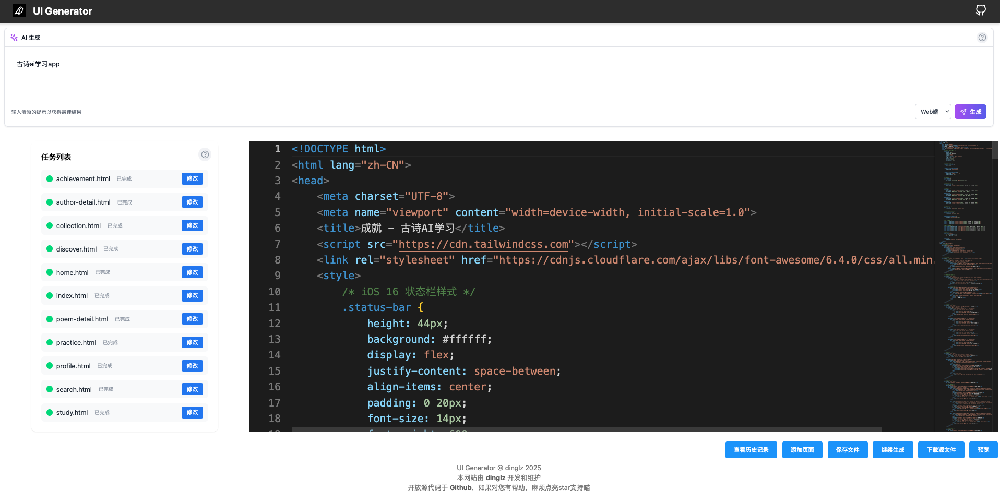

## UI-Generator

<div style="text-align:center;">
</img>
</div>

让idea快速成型！让我们帮助你让创意和想法跃然纸上！

## 简介

**UI-Generator**是一款应用原型生成软件，你可以理解为生成一个应用的前端界面，当你在开发一款应用之前，可以在UI-Generator中输入你的idea，简短或详细都可，从`一个古诗学习app`到详细的细致到每一个功能的描述都可行，然后UI-Generator会利用大模型自动为你生成待生成的界面列表，然后一次为您生成html的界面，效果参考可以移步生成[效果画廊](https://github.com/dingdinglz/ui-generator#%E6%95%88%E6%9E%9C%E7%94%BB%E5%BB%8A)

## Feature

- UI-Generator带有一个易用、简洁的webui，生成的代码结构清晰，一个界面对应一个html文件
- 多模型支持：openai系，ollama（TODO）
- 支持生成：web端、手机端
- 操作简单，易于上手，简单的一句话即可作为参照生成一个应用
- 支持历史记录，加载历史生成结果，修改历史生成结果
- UI-Generator带有一个代码编辑框，在生成结束后你可以通过点击对应的文件名，在编辑框中对文件进行修改，也可以加载历史生成结果后进行修改
- 支持直接预览生成结果
- 支持让AI对文件进行二次修改
- 支持一键下载生成的源代码

> [!WARNING]
> WebUI仅用于本机一键启动方便使用，暂不支持部署与其他人一起使用，未做权限控制

## 使用方法

1. 下载Release中的文件
2. 启动ui，目录下会为您生成config.json，编辑config.json，完成端口和llm配置
3. 再次启动ui，打开localhost:端口号，您就可以开始使用ui-generator了

## 编译方法

1. `go build`得到ui可执行文件
2. 前往[前端仓库](https://github.com/dingdinglz/ui-generator-frontend)获取前端部分代码
3. 前端代码中`npm i`，`npm run build`得到dist文件夹
4. 将dist文件夹复制到与ui文件同一目录，并将dist文件夹更名为web
5. 此时，目录下应该有ui可执行文件，web文件夹
6. 按照使用方法启动即可

## 画廊



## 效果画廊

### 古诗学习app

prompt：古诗ai学习app，mode：手机端，使用模型：deepseekV3


### 教学Agent

prompt：

``` markdown
# 教学实训智能体软件
## 教师侧
- 备课与设计：根据所提供的本地课程大纲、课程知识库文档等自动设计教学内容，包括知识讲解、实训练习与指导、时间分布等。
- 考核内容生成：根据教学内容自动生成考核题目及参考答案，考核题目种类可多样化，根据学科设计，如计算机类可设计相关编程题和答案
- 学情数据分析：对学生提交的答案进行自动化检测，提供错误定位与修正建议。对学生整体数据进行分析，总结知识掌握情况与教学建议。
## 学生侧
- 在线学习助手：对学生的提出的问题，结合教学内容进行解答;
- 实时练习评测助手：根据学生历史练习情况，以及学生的练习要求，生成随练题目，并对练习纠错。
## 管理侧
- 用户管理：管理员/教师/学生等用户的基本管理
- 课件资源管理：按学科列表教师备课产生的课件、练习等资源，可以导出。
## 大屏概览
- 教师使用次数统计/活跃板块(当日/本周)
- 学生使用次数统计/活跃板块(当日/本周)
- 教学效率指数(备课与修正耗时、课后练习设计与修正耗时、课程优化方向(如：某学科通过率持续偏低))
- 学生学习效果(平均正确率趋势、知识点掌握情况，高频错误知识点等)
```

mode：web端，使用模型：claude4

